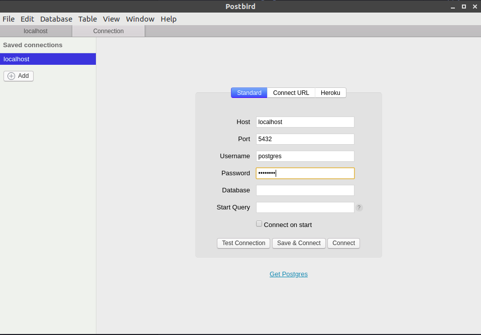
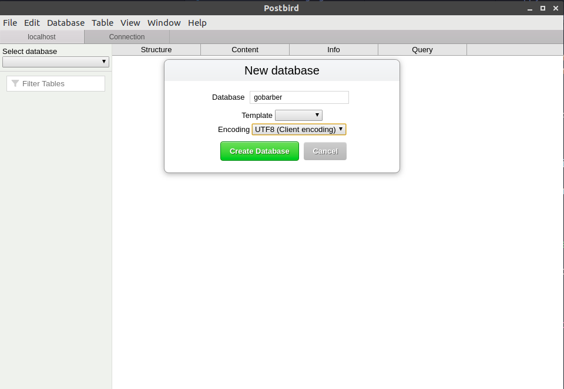

## Go Stack Bootcamp
- Treinamento imersivo nas tecnologias mais modernas de desenvolvimento web e mobile.

[Modulo 1](https://github.com/MaichiLydia/GoStack-Modulo1)

### Modulo 2

#### Requisitos

- [Vscode](https://code.visualstudio.com/Download)
- [node download](https://nodejs.org/en/download/) e [node documentação](https://nodejs.org/en/docs/)
- [yarn](https://yarnpkg.com/)
- [HTTP Métodos](https://www.w3schools.com/tags/ref_httpmethods.asp)
- [API REST](https://becode.com.br/o-que-e-api-rest-e-restful/)
- [express getting started](https://expressjs.com/en/starter/installing.html) e [express reference](https://expressjs.com/en/4x/api.html)
- [Docker get started](https://www.docker.com/get-started) e [Docker documentação](https://docs.docker.com/)
- [Postbird](https://www.electronjs.org/apps/postbird)

#### Sumário
- [Configurando estrutura](#configurando-estrutura)
- [Nodemon e Sucrase](#nodemon-e-sucrase)
- [Configurando debugger](#configurando-debugger)
- [Conceitos de Docker](#conceitos-de-docker)
- [Configurando docker](#configurando-docker)
- [Conceitos ORM e Sequelize](#conceitos-orm-e-sequelize)
- [ESLint Prettier EditorConfig](#eslint-prettier-editorconfig)


#### Configurando estrutura
Começamos esse módulo criando a pasta e inicializando um projeto com yarn, logo após instalando o express
```
yarn init -y
yarn add express
```
Depois criamos uma pasta chamada `src` na raiz do projeto e nela adicionamos os arquivos `app.js` `server.js` e `routes.js`.

- Separamos a nossa aplicação do servidor, pois ao fazermos testes automatizados a parte do servidor não será utilizada, veremos mais em frente

#### Nodemon e Sucrase
O node não suporta as novas funcionalidade do js, como a sintaxe de import e export, para conseguirmos utilizar isso nós instalamos `sucrase`:
`yarn add nodemon sucrase -D`

(e já instalamos o nodemon junto, ambos na opção de desenvolvimento)

Com isso conseguimos mudar disso, por exemplo no arquivo `routes.js`:

`const { Router } = require('express');`

para:

`import { Router } from 'express';`

E também: 

`module.exports = routes;`

para:

`export default routes;`

e com isso mudaremos em todos os arquivos, `app.js` e `server.js`.

Se a gente tentar rodar a aplicação passando: 
`node src/server.js`

dará erro, para que dê certo devemos utilizar: 
`yarn sucrase-node src/server.js`

Para que o comando fique fácil e não necessite reinicializar após cada modificação, utilizamos o `nodemon`, adicionamos a seção de `scripts` no `package.json`:
```
  "scripts": {
    "dev": "nodemon src/server.js"
  },
```
e é necessário configurar o nodemon para que ele execute o sucrase antes, criando um arquivo `nodemon.json` na raiz do projeto e passando as informações necessárias: 
```
{
    "execMap": {
        "js": "node -r sucrase/register"
    }
}
```

#### Configurando debugger
Para configurar o debugger, será necessário mudar no launch.json o request e o protocol, ficando assim:
```
{
    // Use IntelliSense to learn about possible attributes.
    // Hover to view descriptions of existing attributes.
    // For more information, visit: https://go.microsoft.com/fwlink/?linkid=830387
    "version": "0.2.0",
    "configurations": [
        {
            "type": "node",
            "request": "attach",
            "name": "Attach Program",
            "restart": true,
            "skipFiles": [
                "<node_internals>/**"
            ],
            "protocol": "inspector"
        }
    ]
}
```
 E também adicionar ao `scripts`:
`"dev:debug": "nodemon --inspect src/server.js"`
isso faz com que nossa configuração do nodemon pegue para o debugger também.

#### Conceitos de Docker
 Controlar serviços da aplicação - banco de dados, envio de email, etc
##### Como funciona ? 
 - Criação de ambientes isolados(container) -> Para que a configuração e pastas não criem dependencias ou conflitos na nossa máquina, isolamos esse serviço num ambiente e tornamos a exclusão, atualização ou até mesmo a substituição mais simples.
 - Containers expõem portas para comunicação.

##### Principais conceitos: 
- Imagem: Serviços/ferramentas disponíveis para utilização
- Container: instância de uma imagem.
- Docker Registry (Docker Hub) -> onde encontrar as imagens
- Dockerfile - Receita para criar uma imagem.

#### Configurando Docker
Para configurar o docker será necessário seguir as instruções do site: https://www.docker.com/get-started conforme o seu sistema operacional, após instalado é possível verificar se tudo deu certo com os seguintes comandos: `docker --version` e `docker help`

Utilizamos o docker com a imagem do postgres: https://hub.docker.com/_/postgres

`docker run --name dabase -e POSTGRES_PASSWORD=qualquer -p 5432:5432 -d postgres`
--name ${nome}: para o nome da sua aplicação
-e: para variaveis, podemos ver mais opções no link da imagem, exemplo: POSTGRES_PASSWORD=${senha}
-p ${Porta na sua maquina}:${Porta na imagem do docker} - redirecionamento de porta
-d ${nome da imagem no docker hub} - para passar qual imagem queremos
Ao terminar de executar o docker retorna um id único do container e podemos utilizá-lo para testar se tudo funcionou corretamente:
`docker ps`
E verificar se o id gerado está na tabela q o `docker ps` printou no console.

Para visualizarmos o nosso banco, é possível baixar um client de postgres, nesse curso utilizamos o [postbird](https://www.electronjs.org/apps/postbird)

Deixando as configuraçoes assim:


E criamos um novo database já utilizando o postbird:


Para garantirmos que a mesma instancia do banco de dados seja iniciada corretamente, mesmo quando reiniciarmos nossa máquina ou parar esse container com `docker stop database` podemos utilizar o id único ou o nome no comando `docker start`, por exemplo: 
```
docker start database
```
Caso de algum erro é possível veriricar os logs: 
``` 
docker logs database
```

Também é possível utilizar esse mesmo container para outras aplicações, mas o ideal é que seja isolado e especifico para cada aplicação e veremos isso em outra aula.

#### Conceitos ORM e Sequelize
##### ORM - Object Relational Mapping
- Abstração do banco de dados - mudando a comunicação com o banco
- Tabelas viram models
- A manipulação dos dados ficam sem queries SQL, no caso da nossa aplicação utilizaremos apenas código javascript para que isso aconteça.
##### Migrations
- Controle de versão para base de dados, para que a base esteja sempre atualizada entre todos os envolvidos no projeto e no ambiente de produção. 
- Cada arquivo contém instruções para criação, alteração ou remoção de tabelas ou colunas e a ordenação ocorre por data.
- É possível desfazer uma migração se errarmos algo enquanto estivermos desenvolvendo a feature
- **Não** é possível editar a migration após implementada para outras pessoas e/ou ambientes.
- Cada migration deve realizar alterações em apenas uma tabela, é possível criar várias migrations para alterações maiores.

##### Seeds
- arquivos que populam a base de dados para desenvolvimento
- Muito utilizados para testes
- Execuutável apenas por código
- Jamais utilizado em produção
- Caso sejam dados que precisam ir para produção, a própria migration pode manipular dados das tabelas

##### Arquitetura MVC - Model, View, Controller
- Model: ele abstrai as figuras principais da aplicação, nesse tutorial utilizaremos para abstração do banco, utilizado para manipular os dandos contidos nas tabelas e não possuem responsabilidades sobre a regra de negócio da nossa aplicação.
- Controller: é o ponto de entrada das requisições da nossa aplicação, uma rota geralmente está associada diretamente com um método do controller. Podemos incluir a grande parte das regras de negócio da aplicação nos controllers(conforme a aplicação cresce podemos isolar as regras).
    - Classes
    - Sempre retorna um JSON
    - Não chama outro controller/método
    - Quando criar um controller:
      - Toda vez que tiver uma nova entidade
      - Apenas 5 métodos;
- View: é o retorno ao cliente, em aplicações que não utilizam o modelo de API REST o retorno pode ser um HTML ou txt, mas no nosso caso a view é apenas nosso JSON que será retornado ao front-end e depois manipulado pelo ReactJS ou React Native.
